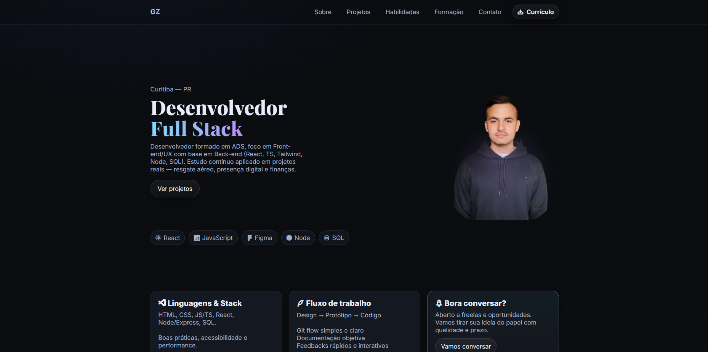

<h1 align="center">Portfólio — Gustavo Zatti</h1>

  <picture>
    <source srcset="assets/img/preview.png" type="image/webp">
    
  </picture>

---

## ✨ O que você encontra aqui

- **Projetos em destaque** com descrição curta e links
- **Tecnologias que uso** no dia a dia
- **Sobre mim** (Curitiba — PR) e objetivos profissionais
- **Contato direto** por WhatsApp com mensagem pré-preenchida
- **Botão de download do currículo** no topo do site

---

## 🧰 Tecnologias & práticas

- **HTML semântico**, **CSS (Grid/Flex)** e **JavaScript** para interações leves  
- Imagens otimizadas (WebP/PNG) e `loading="lazy"` no site  
- Metadados de **SEO/OG** para melhor compartilhamento

---

## 🔗 Links úteis

- **🌐 Site:** https://zatticode.github.io/portfolio  
- **💬 WhatsApp:**  
  [Abrir conversa](https://wa.me/5541997155243?text=Ol%C3%A1%2C%20Gustavo%21%20Vim%20pelo%20seu%20Portf%C3%B3lio.) — “Olá, Gustavo! Vim pelo seu Portfólio.”
- **⬇️ Currículo:** disponível no menu do site

---

## 🤝 Contribuições

Achou algo para melhorar? Abra uma *Issue* ou envie um *PR*. Feedbacks são bem-vindos!

---

  Feito com ❤️ por <a href="https://github.com/ZattiCode">Gustavo Zatti</a>

